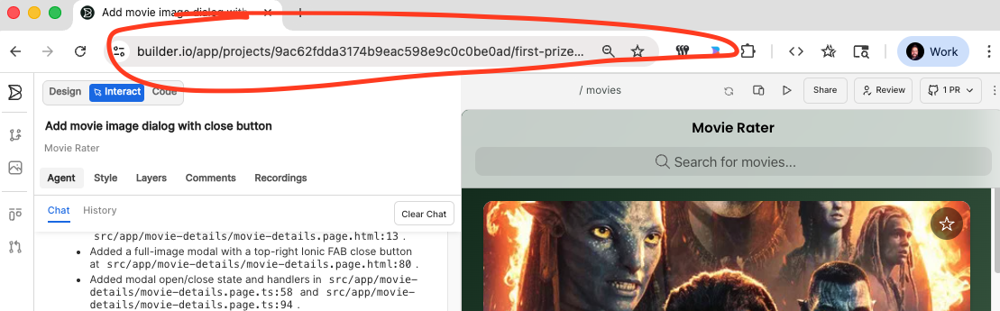

# Sample Mobile Projects

This is a demonstration of iOS and Android projects that were built using a Builder Prototype project. The prototype project was vibe coded in Builder and the handoff feature was used to implement these native projects.

## Prerequisites
- Xcode and Android Studio installed
- Node installed

## Launching Builder
For Mobile apps there are 2 routes you can take:
- Use the [Builder Extension](https://marketplace.visualstudio.com/items?itemName=Builder.Builder) in your IDE (Cursor, VS Code etc)
- Use the [Builder Desktop App](https://www.builder.io/desktop-app) via CLI by running `npx @builder.io/dev-tools@latest launch --app --chat`

## How?
- A blank iOS app was created using Xcode.
- A blank Android app was created using Android Studio.
- A blank React Native app was created using `npx create-expo-app@latest react-native-app --yes`
- Use the Builder VS Code extension (`Code` tab) or run the desktop app `npx @builder.io/dev-tools@latest launch --app --chat`
- Ask builder to `Run npx builder-doctor install-skill android-native`
- Ask builder to `Run npx builder-doctor install-skill ios-native`

### Import the Prototype
In your Builder prototype copy the URL:

Then in your local IDE ask Builder:
`Import the prototype {url}`

You could also choose to bring in just the components or screens you need:
`Import the movie rating card component from the prototype {url}`